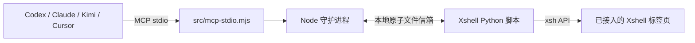

# Xshell Agent Bridge

**Xshell MCP Server for AI Agents** — 一个面向 Codex、Claude Code、Kimi Code CLI、Cursor 等 MCP 客户端的本地桥接程序，让 AI Agent 能读取和操作已打开的 Xshell 终端标签页。

它适合需要由 AI 协助完成服务器巡检、部署、排障或重复终端操作的场景。Agent 不会直接连接你的服务器；它只能操作你在 Xshell 中已连接、并主动接入桥接脚本的标签页。

关键词：Xshell MCP、MCP server、AI terminal automation、Codex、Claude Code、Cursor、Kimi Code CLI、SSH terminal bridge。

## 能力与边界

| 能力 | 说明 |
| --- | --- |
| 读取终端 | 获取当前可见的 Xshell 屏幕内容。 |
| 写入终端 | 发送精确文本、可选按回车，或发送 `Ctrl+C`。 |
| 等待输出 | 等待屏幕出现指定文本，便于确认命令结果。 |
| 多 Agent 协作 | 同一标签页可被多个 Agent 读取；写操作会排队执行。 |
| 本机运行 | 守护进程只监听 `127.0.0.1`，不对外暴露 HTTP 服务。 |

它不会扫描 `.xsh` 会话文件，也不会读取或返回 Xshell 已保存的密码、密钥。终端可见内容仍可能包含敏感信息；而且发送文本等同于在当前会话中手动输入命令，权限与该会话完全一致。

## 工作原理



Xshell 内嵌 Python 的能力有限，因此桥接最后一段使用 `data/ipc/` 下的原子 JSON 文件通信：脚本上报屏幕与会话状态，守护进程投递命令。命令被脚本领取后不会自动重试，避免在崩溃或断连后重复执行。

## 快速开始

### 1. 准备环境

- Node.js 20 或更高版本
- Xshell 8
- 任一支持 MCP stdio 的 Agent 客户端

项目没有 npm 第三方依赖。先在项目目录运行测试：

```powershell
npm test
```

需要单独观察桥接服务时，可启动守护进程：

```powershell
npm start
```

首次启动会创建本机专用的 `config/local.json`，其中含随机鉴权令牌。该文件已经被 Git 忽略，不能提交或分享。

### 2. 接入一个 Xshell 标签页

在要让 Agent 操作的 Xshell 标签页中选择：

`工具 → 脚本 → 运行`

然后打开：

```text
xshell\xshell_agent_bridge.py
```

每个需要接入的标签页都要运行一次脚本。脚本会持续运行、每隔约 250ms 更新状态；关闭标签页或停止脚本后，该会话会自动离线。

### 3. 配置 Agent 客户端

仓库已包含 Codex、Kimi Code CLI 与 Claude Code 的项目级 MCP 配置。重新打开项目或在项目目录启动对应客户端后即可使用。

其他 MCP 客户端以以下命令启动服务：

```powershell
node C:\绝对路径\src\mcp-stdio.mjs
```

可选环境变量 `XSHELL_AGENT_ID` 用于在审计日志中区分调用方。各客户端的配置示例见 [docs/CLIENTS.md](docs/CLIENTS.md)。

## 推荐操作流程

Agent 操作终端时，建议始终遵循以下顺序：

1. 调用 `xshell_health`，确认守护进程运行且存在在线会话。
2. 调用 `xshell_list_sessions`，多标签页时明确选择目标 `session_id`。
3. 调用 `xshell_read_screen`，确认主机、用户、提示符和当前正在运行的命令。
4. 仅在用户知情的情况下调用 `xshell_send` 或 `xshell_interrupt`。
5. 再次读屏，或调用 `xshell_wait_for` 等待预期输出，确认命令的实际结果。

`xshell_send` 的“完成”只表示 Xshell 已接受输入，不代表远端命令已执行成功；最后一步的读屏或等待是必要的。

### MCP 工具

| 工具 | 用途 | 是否写入终端 |
| --- | --- | --- |
| `xshell_health` | 检查守护进程与在线会话数量 | 否 |
| `xshell_list_sessions` | 列出已接入的标签页 | 否 |
| `xshell_read_screen` | 读取最新可见屏幕 | 否 |
| `xshell_send` | 发送文本，可选择回车 | 是 |
| `xshell_interrupt` | 发送 `Ctrl+C` | 是 |
| `xshell_wait_for` | 等待屏幕出现目标文本 | 否 |

## 本地验证与排障

不需要 Xshell 也可以验证完整流程：

```powershell
npm run demo:bridge
```

常见情况：

| 现象 | 处理方式 |
| --- | --- |
| `onlineSessions: 0` | 在目标 Xshell 标签页重新运行 `xshell_agent_bridge.py`。 |
| 会话显示离线 | 确认标签页仍连接且脚本没有停止；每个新标签页都需要单独接入。 |
| Agent 无法发现工具 | 重新打开项目或重启 Agent 客户端，确认其 MCP 配置已加载。 |
| 命令已发送但没有结果 | 先读屏；长命令需要用 `xshell_wait_for` 等待标志文本或提示符。 |
| 守护进程端口冲突 | 修改 `config/local.json` 的本机端口后，重启守护进程和 Agent 客户端。 |

## 安全与审计

- 写操作按 Xshell 标签页串行化，避免多个 Agent 同时输入。
- 默认最大输入长度为 8192 字符；会话超过 5 秒未上报状态会被视为离线。
- 写操作元数据会记录到 `data/audit.jsonl`，只保存文本长度等元数据，不保存命令原文。
- `data/` 会短暂保存屏幕快照和待执行输入，已被 Git 忽略，并继承当前 Windows 用户的文件权限。停止脚本后可删除其中的过期会话目录。
- 请将 `xshell_send` 和 `xshell_interrupt` 视为高风险写操作，并在 Agent 客户端中保留人工审批。

## 发布与可发现性

README 已使用 Xshell MCP、AI terminal automation 与主流 Agent 的自然语言描述，便于 GitHub、网页搜索和 AI 检索理解项目用途。要让外部用户真正搜到项目，发布到公开 GitHub 仓库时还应：

1. 使用清晰的仓库名，例如 `xshell-agent-bridge`。
2. 设置仓库简介：`Local MCP server that lets AI agents safely control attached Xshell terminal sessions.`
3. 添加 Topics：`xshell`、`mcp`、`model-context-protocol`、`ai-agents`、`terminal-automation`、`codex`、`claude-code`。
4. 保持本 README、版本号和开源许可证完整；公开仓库被搜索引擎收录需要一些时间。

## 开发命令

```powershell
npm test          # 运行测试
npm start         # 启动守护进程
npm run mcp       # 以 MCP stdio 方式启动
npm run demo:bridge # 运行模拟 Xshell 演示
```
