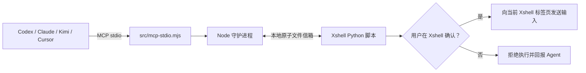

# Xshell Agent Bridge

**Xshell MCP Server for AI Agents** — 一个面向 Codex、Claude Code、Kimi Code CLI、Cursor 等 MCP 客户端的本地桥接程序，让 AI Agent 能读取和操作已打开的 Xshell 终端标签页。

> v0.2.0 安全确认版：Agent 每次准备向终端写入内容时，都必须解释用途、预期结果和风险；Xshell 会显示完整输入并弹出“是/否”确认框。只有用户亲手点击“是”，内容才会发送到服务器。

它适合需要由 AI 协助完成服务器巡检、部署、排障或重复终端操作的场景。Agent 不会直接连接你的服务器；它只能操作你在 Xshell 中已连接、并主动接入桥接脚本的标签页。

关键词：Xshell MCP、MCP server、AI terminal automation、Codex、Claude Code、Cursor、Kimi Code CLI、SSH terminal bridge。

## 能力与边界

| 能力 | 说明 |
| --- | --- |
| 读取终端 | 获取当前可见的 Xshell 屏幕内容。 |
| 写入终端 | 每次先在 Xshell 本地弹窗确认，再发送精确文本、回车或 `Ctrl+C`。 |
| 等待输出 | 等待屏幕出现指定文本，便于确认命令结果。 |
| 多 Agent 协作 | 同一标签页可被多个 Agent 读取；写操作会排队执行。 |
| 本机运行 | 守护进程只监听 `127.0.0.1`，不对外暴露 HTTP 服务。 |

它不会扫描 `.xsh` 会话文件，也不会读取或返回 Xshell 已保存的密码、密钥。终端可见内容仍可能包含敏感信息；而且发送文本等同于在当前会话中手动输入命令，权限与该会话完全一致。

## 工作原理



Xshell 内嵌 Python 的能力有限，因此桥接最后一段使用 `data/ipc/` 下的原子 JSON 文件通信：脚本上报屏幕与会话状态，守护进程投递操作申请。脚本领取申请后先调用 Xshell 8 的 `MessageBox` 显示本地确认框；用户同意后才调用 `xsh.Screen.Send`。操作不会自动重试，避免在崩溃或断连后重复执行。

## 快速开始

### 1. 准备环境

- Node.js 20 或更高版本
- Xshell 8
- 任一支持 MCP stdio 的 Agent 客户端

项目没有 npm 第三方依赖，不需要执行 `npm install`。仓库已经包含 Codex、Kimi Code CLI 和 Claude Code 的项目级 MCP 配置；在项目目录重新打开 Agent 客户端后，首次调用工具时会自动启动 Node 守护进程。

首次自动启动会创建本机专用的 `config/local.json`，其中含随机鉴权令牌。该文件已经被 Git 忽略，不能提交或分享。

### 2. 接入一个 Xshell 标签页

在要让 Agent 操作的 Xshell 标签页中选择：

`工具 → 脚本 → 运行`

然后打开：

```text
xshell\xshell_agent_bridge.py
```

每个需要接入的标签页都要运行一次脚本。脚本会持续运行、每隔约 250ms 更新状态；关闭标签页或停止脚本后，该会话会自动离线。

### 3. 告诉 Agent 你要做什么

例如：“检查 Docker 是否安装，不要执行其他操作。”Agent 可以直接读取屏幕。涉及终端输入时，流程如下：

1. Agent 先在对话中说明这一步要做什么。
2. Xshell 弹窗显示目标主机、Agent、风险等级、原因、预期结果和完整输入。
3. 你检查内容：点击“是”才执行；点击“否”不会向服务器发送任何内容。
4. Agent 读取执行后的屏幕，再解释结果并提出下一步。

因此，普通使用者日常只需：**打开 Xshell → 运行桥接脚本 → 向 Agent 描述任务 → 逐条确认写操作**。

### 4. 其他 Agent 客户端

仓库已包含 Codex、Kimi Code CLI 与 Claude Code 的项目级 MCP 配置。重新打开项目或在项目目录启动对应客户端后即可使用。

其他 MCP 客户端以以下命令启动服务：

```powershell
node C:\绝对路径\src\mcp-stdio.mjs
```

可选环境变量 `XSHELL_AGENT_ID` 用于在审计日志中区分调用方。各客户端的配置示例见 [docs/CLIENTS.md](docs/CLIENTS.md)。

## 推荐操作流程

Agent 操作终端时必须遵循以下顺序：

1. 调用 `xshell_health`，确认守护进程运行且存在在线会话。
2. 调用 `xshell_list_sessions`，多标签页时明确选择目标 `session_id`。
3. 调用 `xshell_read_screen`，确认主机、用户、提示符和当前正在运行的命令。
4. 在对话中向用户说明单个步骤的用途、预期结果、风险和完整命令，不把无关步骤打包成一次输入。
5. 调用 `xshell_send` 或 `xshell_interrupt`，等待用户在 Xshell 本地点击“是”或“否”。
6. 再次读屏，或调用 `xshell_wait_for` 等待预期输出，确认命令的实际结果，再提出下一步。

`xshell_send` 的“完成”只表示用户已批准且 Xshell 已接受输入，不代表远端命令执行成功；最后一步的读屏或等待仍然必要。

## 使用注意事项

### 屏幕读取不是截图

桥接脚本通过 Xshell 的文本接口读取当前终端窗口，返回的是可见文字而不是图片。当前版本只读取窗口中现有的行和列，不会读取已经滚出窗口的完整回滚历史。

因此：

- 短命令和少量输出可以直接读屏确认。
- 输出速度很快时，某些文字可能在两次屏幕采集之间滚出窗口；`xshell_wait_for` 不应作为高吞吐日志的唯一判断依据。
- 不要依赖扩大 Xshell 回滚行数来保存部署证据；桥接程序仍然只保证读取当前可见区域。

### 长任务和大量日志必须落盘

部署 JAR、启动服务、构建项目或运行长任务时，应先把标准输出和错误输出写入服务器日志文件，再使用 `tail`、`grep`、`sed` 或 `journalctl` 分段检查。例如：

```bash
nohup java -jar app.jar > app.log 2>&1 &
tail -n 100 app.log
grep -nEi 'error|exception|failed' app.log | tail -n 100
```

随后还应检查进程、监听端口或应用健康接口，不能仅凭终端最后几行判断部署成功。以上每一条终端写操作在 v0.2.0 中都需要单独说明，并由用户在 Xshell 确认。

### 密码和敏感凭据必须由用户亲自输入

Agent 不得请求、代填、传输或保存密码、口令、Passphrase、PIN、OTP、验证码、Token、API Key 等敏感凭据。遇到认证提示时，标准流程是：

1. Agent 识别到密码或验证码提示后停止发送输入。
2. Agent 请用户切换到 Xshell，并在终端中亲自输入敏感内容。
3. 用户输入完成后通知 Agent；Agent只读取后续状态和非敏感输出，再提出下一步。

桥接核心会在两处强制拦截：

- 当前屏幕末尾出现 `Password:`、密码、口令、Passphrase、OTP、验证码、PIN、Token 等输入提示时，拒绝 Agent 的文本发送请求。
- 输入内容疑似使用 `sshpass`、`sudo -S`、命令行密码参数、URL 内嵌凭据或密码环境变量时，在写入 IPC 文件之前拒绝。

不要把密码发在 Agent 对话中，也不要把密码写入命令行让 Agent 代为执行。自动识别用于防止常见误操作，不能代替用户核对 Xshell 弹窗中的完整命令。

### MCP 工具

| 工具 | 用途 | 是否写入终端 |
| --- | --- | --- |
| `xshell_health` | 检查守护进程与在线会话数量 | 否 |
| `xshell_list_sessions` | 列出已接入的标签页 | 否 |
| `xshell_read_screen` | 读取最新可见屏幕 | 否 |
| `xshell_send` | 提议发送文本；必须提供解释、预期结果和风险，并由用户在 Xshell 确认 | 是 |
| `xshell_interrupt` | 提议发送 `Ctrl+C`；同样需要本地确认 | 是 |
| `xshell_wait_for` | 等待屏幕出现目标文本 | 否 |

## 本地验证与排障

不需要 Xshell 也可以验证完整流程：

```powershell
npm run demo:bridge
```

常见情况：

| 现象 | 处理方式 |
| --- | --- |
| `onlineSessions: 0` | 在目标 Xshell 标签页重新运行 `xshell_agent_bridge.py`。 |
| 会话显示离线 | 确认标签页仍连接且脚本没有停止；每个新标签页都需要单独接入。 |
| Agent 无法发现工具 | 重新打开项目或重启 Agent 客户端，确认其 MCP 配置已加载。 |
| 提示 `APPROVAL_UNAVAILABLE` | 当前标签页仍在运行旧版脚本；停止脚本并重新运行仓库中的 v0.2.0 脚本。 |
| 提示 `DAEMON_VERSION_MISMATCH` | 本机仍有 v0.1.0 守护进程；先停止旧进程，再重新打开 Agent 客户端，让 v0.2.0 自动启动。 |
| Xshell 弹出安全确认框 | 核对目标主机、说明、风险和完整输入；同意选“是”，不确定或不同意选“否”。 |
| 弹窗中的中文说明变成 `?` | 正常 Agent 项目配置会直接使用 UTF-8。手动用旧版 Windows PowerShell 管道调试时，应先设置 `$OutputEncoding = [System.Text.UTF8Encoding]::new($false)`，否则中文会在进入 MCP 前丢失。 |
| 用户拒绝后工具报错 | 这是正常的安全结果；没有任何输入发送到服务器。 |
| 命令已发送但没有结果 | 先读屏；长命令需要用 `xshell_wait_for` 等待标志文本或提示符。 |
| 守护进程端口冲突 | 修改 `config/local.json` 的本机端口后，重启守护进程和 Agent 客户端。 |

## 安全与审计

- 写操作按 Xshell 标签页串行化，避免多个 Agent 同时输入。
- v0.2.0 只向声明支持 `xshell-dialog-v1` 的新脚本投递写操作；旧版无确认脚本默认拒绝。
- `xshell_send` 和 `xshell_interrupt` 强制要求 Agent 提供解释、预期结果及 `low` / `medium` / `high` / `critical` 风险等级。
- 密码提示和常见命令行凭据模式会在桥接核心中被拒绝，敏感内容必须由用户直接在 Xshell 输入。
- 最终批准发生在 Xshell 本地“是/否”窗口中，不依赖不同 Agent 客户端各自的审批设置。
- 默认最大输入长度为 8192 字符；会话超过 5 秒未上报状态会被视为离线；人工确认等待时间至少为 120 秒，旧版本地配置会在内存中自动提升，无需改动令牌文件。
- 写操作元数据会记录到 `data/audit.jsonl`，只保存文本长度等元数据，不保存命令原文。
- `data/` 会短暂保存屏幕快照和待执行输入，已被 Git 忽略，并继承当前 Windows 用户的文件权限。停止脚本后可删除其中的过期会话目录。
- Agent 客户端自身的写工具审批建议继续保留，作为 Xshell 本地确认之外的额外保护。

## 发布与可发现性

README 已使用 Xshell MCP、AI terminal automation 与主流 Agent 的自然语言描述，便于 GitHub、网页搜索和 AI 检索理解项目用途。要让外部用户真正搜到项目，发布到公开 GitHub 仓库时还应：

1. 使用清晰的仓库名，例如 `xshell-agent-bridge`。
2. 设置仓库简介：`Local MCP server that lets AI agents safely control attached Xshell terminal sessions.`
3. 添加 Topics：`xshell`、`mcp`、`model-context-protocol`、`ai-agents`、`terminal-automation`、`codex`、`claude-code`。
4. 保持本 README、版本号和开源许可证完整；公开仓库被搜索引擎收录需要一些时间。

## 开发命令

```powershell
npm test          # 运行测试
npm start         # 启动守护进程
npm run mcp       # 以 MCP stdio 方式启动
npm run demo:bridge # 运行模拟 Xshell 演示
```
